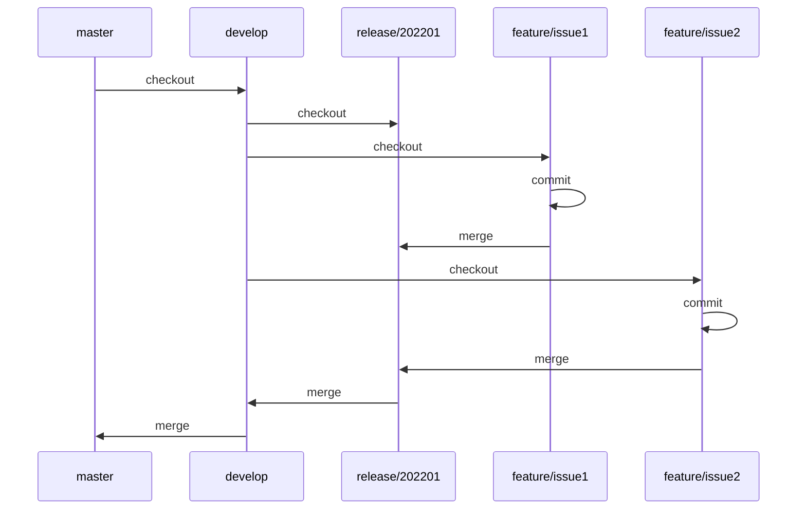

# Angular Template

## Development Server

Run `npm start` for a dev server. Navigate to `http://localhost:8888/`. The app will automatically reload if you change any of the source files.

## Git Flow

